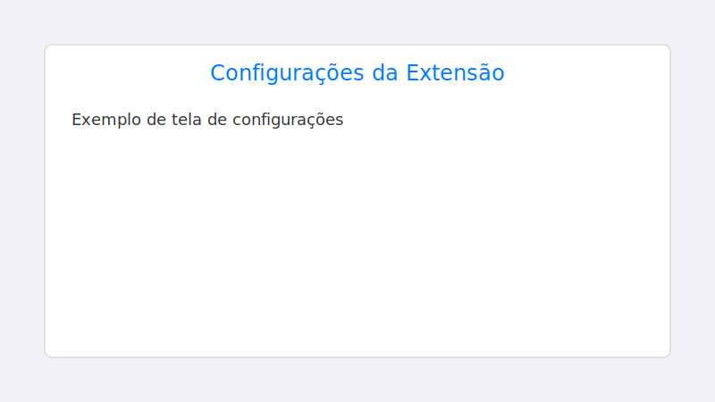
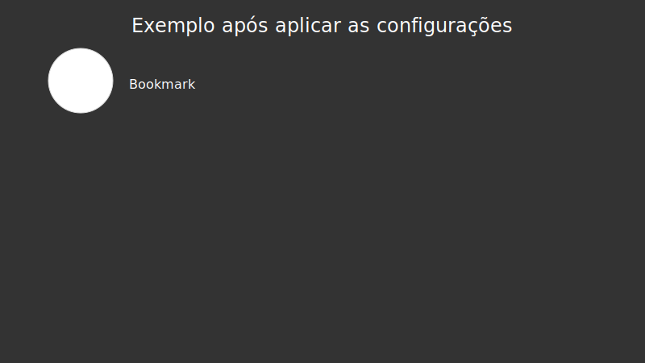

# Página Inicial Personalizada

Esta extensão do Chrome substitui a nova guia padrão por uma página personalizável. Ela permite organizar favoritos em categorias, adicionar ou remover links e exibir papéis de parede locais de forma rotativa.

## Instalação
1. Baixe ou clone este repositório em seu computador.
2. Abra `chrome://extensions/` no Chrome.
3. Ative o **Modo do desenvolvedor**.
4. Clique em **Carregar sem compactação** e selecione a pasta deste projeto.
5. Abra uma nova guia para ver a página inicial personalizada.

## Gerenciamento de favoritos
Na primeira execução a extensão cria uma pasta chamada **Pagina Inicial** em seus favoritos do Chrome. Cada categoria corresponde a uma subpasta dessa pasta e os links são salvos diretamente no gerenciador de bookmarks do navegador. Ao adicionar ou remover links pela interface da extensão, a estrutura de pastas dos favoritos é atualizada automaticamente.

## Configurações

A página `settings.html` permite personalizar diversos aspectos da extensão.

### Fundo Dinâmico
- **Pasta de Wallpapers**: define a pasta local com as imagens que serão exibidas.
- **Frequência de Troca**: intervalo, em horas, para alternar o papel de parede.
- **Cor do Filtro**: cor aplicada sobre a imagem do fundo.
- **Opacidade do Filtro**: intensidade do filtro de cor.

### Bookmarks
- **Tamanho dos Ícones**: tamanho dos ícones dos favoritos.
- **Espaçamento dos Ícones**: espaçamento interno de cada ícone.
- **Distância entre Ícones**: espaço entre os itens na grade.
- **Largura Mínima do Bookmark**: largura mínima de cada item.
- **Exibição do Nome**: mostra o título sempre ou apenas ao passar o mouse.
- **Arredondamento do Ícone**: raio de arredondamento da borda.
- **Cor da Borda**: cor aplicada à borda do ícone.
- **Cor de Fundo do Ícone**: cor de fundo para cada ícone.
- **Fonte dos Favoritos**: família tipográfica usada nos títulos.
- **Tamanho da Fonte**: tamanho dos textos dos favoritos.
- **Cor da Fonte**: cor aplicada aos textos dos favoritos.

### Dados
- **Exportar Dados**: gera um arquivo `.json` com as configurações atuais.
- **Importar Dados**: permite carregar um arquivo `.json` previamente exportado.
- **Reiniciar Configurações**: restaura todos os valores padrão.
